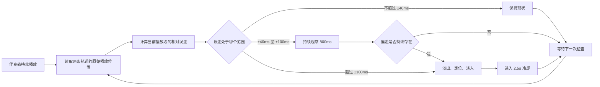
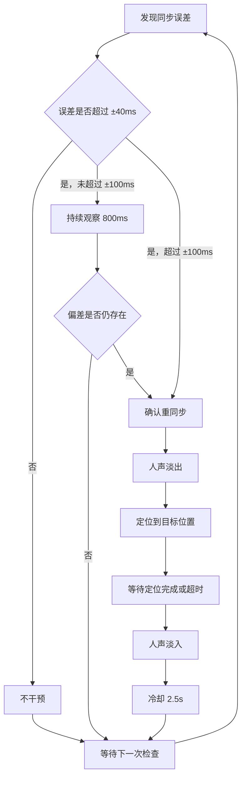
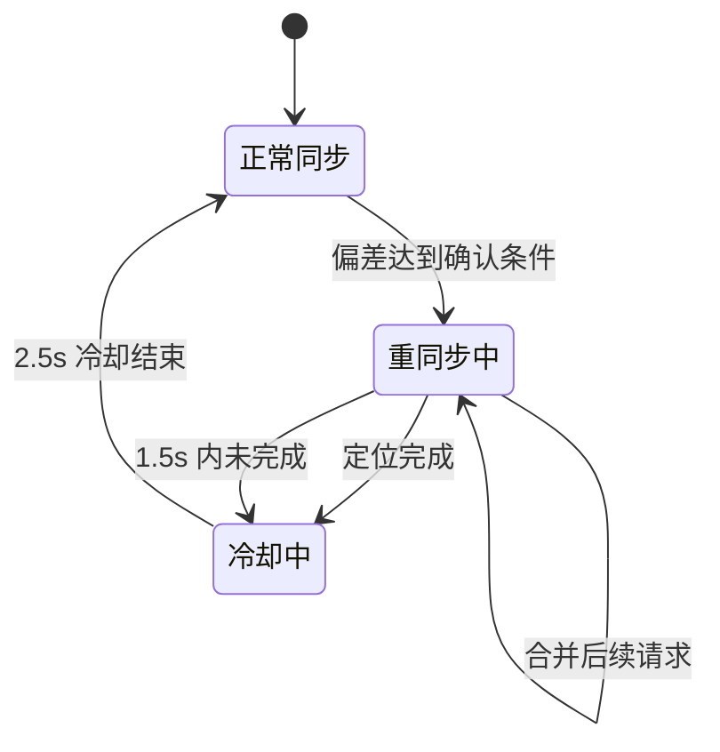
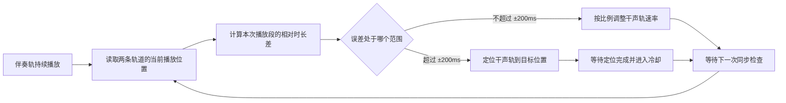
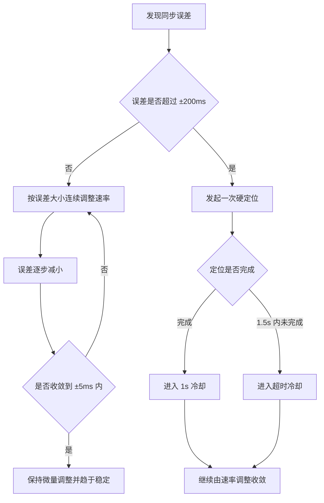
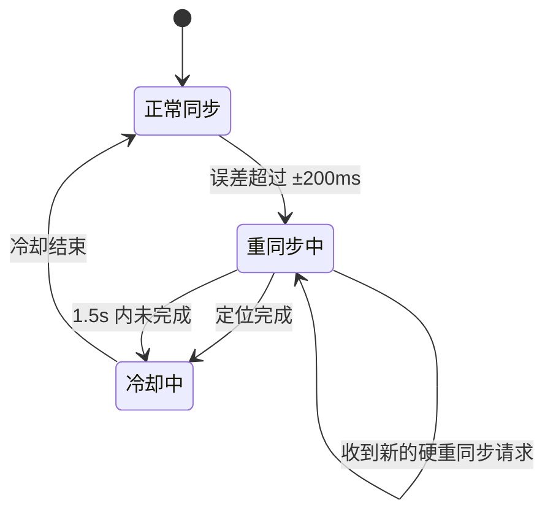

## 1. 设计目标

> 适用范围：首页伴奏轨与干声轨同步播放
> 实现位置：播放器 composable 与双轨重同步工具
> 最后更新：2026-09-19

首页播放时，以伴奏轨作为同步参考，控制干声轨与伴奏轨保持稳定同步。两条轨道继续使用独立的媒体元素和独立输出设备，以支持人声与伴奏分别进入不同的 AiSound 插件；本方案不合并为单一音频上下文输出。

由于独立输出设备的音频时钟会产生漂移，不能通过持续修改人声播放速率追赶。浏览器的实时重采样会在人声高频部分产生“滋滋兹”类噪声，因此当前策略改为低频率、带淡入淡出的无变速重同步。

同步误差分级如下：

| 相对误差 | 处理方式 |
| --- | --- |
| ±40ms 以内 | 不干预，允许独立输出设备的瞬时时钟抖动 |
| ±40ms 至 ±100ms | 偏差持续 800ms 后触发一次无缝重同步 |
| 超过 ±100ms | 立即触发一次无缝重同步 |

> **无变速原则**：正常播放期间人声播放速率保持正常值，同步器只在确认漂移后对人声执行淡出、定位、淡入。

## 2. 同步基准

不直接比较两条轨道的绝对播放时间。每次开始播放、继续播放或手动跳转时，记录两条轨道当时的播放位置作为本次播放段的起点：

```text
伴奏相对时长 = 伴奏当前时间 - 伴奏同步起点
干声相对时长 = 干声当前时间 - 干声同步起点
误差 = 伴奏相对时长 - 干声相对时长
```

这样处理后，即使两条轨道的总时长不同，也只比较它们在当前播放段中已经播放了多长时间，不要求总时长一致。

同步反馈闭环如下：



## 3. 无变速重同步

### 3.1 漂移确认

同步反馈使用人声轨的原始播放位置，仍按播放段起点计算相对误差：

- 误差小于 40ms：清除候选，不做任何处理。
- 误差在 40 至 100ms：连续保持 800ms 后才确认重同步。
- 误差达到 100ms：立即确认重同步。

确认逻辑使用独立的纯函数测试，避免独立输出设备的瞬时抖动触发定位。

### 3.2 淡出、定位、淡入

确认重同步后只操作人声轨，不改变伴奏输出设备或插件路由：

1. 人声同步增益在约 15ms 内淡出到 0。
2. 将人声定位到“人声同步起点加上伴奏相对时长”的位置。
3. 等待定位完成，最多等待 1.5s。
4. 以约 15ms 恢复人声同步增益。
5. 重新建立同步基准，并进入 2.5s 冷却期。

同步增益与用户音量、静音状态、改词片段替换状态相乘，不会覆盖用户设置。定位期间不会修改人声播放速率，因此不会触发浏览器持续重采样造成的高频噪声。

无变速重同步可以概括为“确认漂移后，一次完成淡出—定位—淡入”：



### 3.3 串行保护

串行重同步保护机制继续保证同一时间最多只有一次人声定位：

1. 定位完成前合并后续请求。
2. 定位完成或等待 1.5s 超时后结束本次请求。
3. 结束后冷却 2.5s，防止两个独立设备的时钟偏差导致连续定位。

状态流转如下：



### 3.4 淡出—定位—淡入的原理

淡入淡出同步的目的，是把人声轨不可避免的定位瞬间隐藏在静音窗口中。它不会把人声和伴奏合并到同一个输出，也不会改变两条轨道的设备路由：

```text
检测持续漂移
    ↓
人声同步增益在 15ms 内降到 0
    ↓
人声轨定位到伴奏对应的目标位置
    ↓
等待媒体定位完成事件
    ↓
人声同步增益在 15ms 内恢复
```

播放器将人声最终音量拆成多个因素相乘：

```text
最终人声音量 = 用户音量 × 静音/改词状态 × 同步增益
```

因此同步过程只临时改变同步增益，不会覆盖用户音量、整个人声静音或改词片段替换逻辑。淡出和淡入使用短时渐变，而不是瞬间把音量从正常值切到 0 或从 0 切回正常值，可以减少波形不连续造成的 click/pop。

定位期间不会修改播放速率。这样可以避免浏览器为保持音高而持续进行实时重采样，从而降低人声在正常播放期间出现“滋滋兹”高频噪声的概率。由于伴奏和人声仍使用独立媒体元素，两个输出设备的时钟漂移仍会累积，所以同步器在冷却结束后可能再次执行同样的流程。

## 4. 不同总时长的处理

干声轨接近结尾或已经结束时，停止对干声轨进行无缝重同步：

- 媒体已结束时停止同步干预
- 干声轨距离结尾小于 10ms 时停止同步干预

这可以避免伴奏继续播放时，伴奏相对时长持续增长，导致系统不断尝试把干声轨定位到其不存在的后续位置。

## 5. 播放生命周期

- 开始播放：先记录临时同步起点并确保干声轨播放速率为正常值；两条轨道都开始播放后，再记录一次实际播放起点，避免起播瞬时偏差触发重同步
- 暂停后继续：重新记录当前播放位置作为新的同步起点
- 手动跳转：两条轨道跳转后重新记录同步起点
- 任一轨道结束：由伴奏轨的结束事件结束整体播放状态

同步期间使用内部同步标记，防止校正定位触发另一条轨道的交互同步，避免两条轨道互相拉扯。

## 6. 关键参数

| 参数类别 | 值 | 说明 |
| --- | --- | --- |
| 延迟确认重同步阈值 | 40ms | 偏差持续达到确认时间后重同步 |
| 立即重同步阈值 | 100ms | 超过该误差后立即重同步 |
| 小漂移持续确认时间 | 800ms | 过滤独立输出设备的瞬时抖动 |
| 干声轨结尾保护距离 | 10ms | 距离结尾小于该距离时停止同步干预 |
| 人声淡出与淡入 | 15ms | 同步定位的增益过渡 |
| 无缝重同步冷却时间 | 2.5s | 防止连续定位 |
| 定位超时等待时间 | 1.5s | 定位未及时完成时结束本次请求 |

## 7. 已知限制与后续观察

1. 浏览器返回的媒体播放位置和设备音频时钟存在抖动，当前策略容忍短时 ±40ms 波动。
2. 当前以伴奏轨的播放事件作为同步检查时机；不同设备的音频输出延迟仍可能造成实际听感差异。
3. 如果仍有高频噪声，应优先确认人声输出设备或 AiSound 插件链路；播放器正常播放期间不再通过变速纠偏制造重采样。

## 8. 已回退的实验方案

### 8.1 同步反馈使用平滑插值时间

曾改用干声轨平滑插值时间作为控制反馈，预期消除原生时间更新的阶梯延迟。实测发现平滑插值会掩盖真实漂移累积，因此仍使用原始播放位置作为纠偏反馈。

## 9. 当前方案问题复盘

### 9.1 人声连续变速产生高频噪声

**现象**：正常播放期间没有硬重同步日志，但人声轨出现“滋滋兹”高频噪声；播放日志显示人声倍速在多个接近正常值的速率之间持续变化。

**根因**：两个独立媒体元素的时钟存在漂移，旧同步器每 150ms 修改一次人声播放速率。浏览器为保持音高会对人声执行实时重采样，连续调整会产生可闻的颗粒声或电流声。

**修复（2026-09-19）**：

- 移除正常播放中的播放速率纠偏
- 40 至 100ms 漂移需持续 800ms 才确认，超过 100ms 立即确认
- 人声轨执行 15ms 淡出、定位、15ms 淡入
- 保留独立输出设备、AiSound 插件路由和串行定位冷却

<details>
<summary>展开旧版方案与历史问题复盘</summary>

## 10. 过时方案：连续变速同步

以下内容保留旧版连续变速方案，作为问题复盘和设计演进记录。它不代表当前实现，当前实现以第 1 至第 9 节的无变速重同步方案为准。

## 0. 前言

无论是视频还是音频，双轨播放都是其相应的应用场景，本文介绍下双轨播放的同步方案的最佳实践。

比如视频的应用场景：同时播放音频轨道、工作人员访谈轨道。
再比如音频的场景：同时播放干声和伴奏。

本文已音频干声和伴奏进行说明。

## 1. 设计目标

播放时，以伴奏轨作为同步参考，控制干声轨与伴奏轨保持稳定同步。干声和伴奏允许原本总时长不一致，不能因为较短轨道已经结束而持续触发重同步。

同步误差分级如下：

| 相对误差           | 处理方式                       |
| -------------- | -------------------------- |
| ±5ms 以内（含）     | 仍按比例输出微量速率调整，逐步回归正常速率，不设死区 |
| ±5ms 至 ±50ms   | 按误差比例连续微调，步长自适应            |
| ±50ms 至 ±200ms | 按误差比例连续微调，步长自适应            |
| 超过 ±200ms      | 发起一次串行定位重同步；等待定位完成后进入冷却    |

> **无死区原则**：去掉 ±5ms 死区，即使出现 1ms 漂移也输出微量调整，避免停止纠正后残留误差被下一次时钟抖动再次弹入更大的误差区间。

## 2. 同步基准

不直接比较两条轨道的绝对播放时间。每次开始播放、继续播放或手动跳转时，记录两条轨道当时的播放位置作为本次播放段的起点。

同步检查时，分别计算两条轨道从各自起点开始经过的相对时长，再用伴奏轨的相对时长减去干声轨的相对时长，所得结果就是同步误差。

这样处理后，即使两条轨道的总时长不同，也只比较它们在当前播放段中已经播放了多长时间，不要求总时长一致。

同步反馈闭环如下：



## 3. 分级校正

### 3.1 小误差

即使误差在 ±5ms 以内，也不设死区。仍按比例输出速率调整，例如 1ms 漂移只产生约 0.02% 的速率变化，让系统在接近零时以极轻柔的方式回归正常速率。这样可以避免“停止纠正 → 时钟抖动 → 再次弹出”的循环。

### 3.2 中等误差

全部通过干声轨的播放速率短时追赶或等待，调整幅度与误差成比例：

- 伴奏相对时长更大：干声轨加速
- 干声相对时长更大：干声轨减速
- 5 至 50ms：约调整 0.1% 至 1%
- 50 至 100ms：约调整 1% 至 2%
- 100 至 200ms：约调整 2% 至 4%

速率控制具有两个稳定性限制：

- 每 150ms 最多更新一次速率
- 单次速率变化使用比例步长：步长根据当前目标调整量计算，并限制在 0.05% 至 0.5% 之间

比例步长取代了原先的固定 0.2% 步长，使得：

- 漂移接近 0 时步长缩至极轻柔，避免过冲
- 漂移较大时步长自动放大，快速追赶
- 从根本上消除“微小漂移 + 固定大步长 → 过冲 → 反向大步长 → 震荡”的循环

同步控制使用浏览器返回的干声轨原始播放位置作为反馈，放弃平滑插值时间。平滑插值虽然能掩盖原生时间更新约 250ms 的阶梯，但会同时掩盖真实漂移的累积，让控制回路“看到”的时间比实际播放位置平滑但偏差更大。改用原始播放位置后，控制反馈更真实，配合比例步长不会因阶梯式更新导致过冲。

速率计算还会基于平滑后的差值变化速度，预测约 120ms 后的差值。系统根据预测结果提前减速或回正，而硬定位仍只根据当前实际差值判断。因此接近目标时不会因为反馈延迟在正常速率两侧快速摆动。

相比频繁 seek，短时变速可以减少可听见的跳变。

误差处理可以概括为“连续微调优先，硬定位兜底”：



### 3.3 大误差（超过 ±200ms）

误差超过 ±200ms 时，将干声轨定位到当前播放段应有的相对位置，也就是以同步起点为基准，追赶伴奏轨已经经过的相对时长。

目标位置会限制在干声轨总时长范围内。浏览器媒体定位是异步操作，因此硬重同步采用串行状态管理：

1. 第一次满足硬重同步条件时发起定位，并进入“重同步中”。
2. 定位完成前，所有后续硬重同步请求都会被合并，不会发起第二次定位。
3. 定位完成后进入 1s 冷却期，冷却结束后才允许新的硬重同步。
4. 若 1.5s 内未完成定位，也进入同样的冷却期，避免异常媒体持续重试。

因此，短时间内多次发现大偏差时，用户最多听到一次跳变，随后由变速校正继续收敛，不会出现每隔数百毫秒重复 seek 的卡顿。

硬重同步的状态流转如下：



## 4. 不同总时长的处理

干声轨接近结尾或已经结束时，停止对干声轨进行播放速率校正和定位：

- 媒体已结束时停止同步干预
- 干声轨距离结尾小于 10ms 时停止同步干预

这可以避免伴奏继续播放时，伴奏相对时长持续增长，导致系统不断尝试把干声轨 seek 到其不存在的后续位置。

## 5. 播放生命周期

- 开始播放：先记录临时同步起点并将干声轨播放速率恢复为正常值；两条轨道都开始播放后，再记录一次实际播放起点，避免起播瞬时偏差触发硬重同步
- 暂停后继续：重新记录当前播放位置作为新的同步起点
- 手动跳转：两条轨道跳转后重新记录同步起点
- 任一轨道结束：由伴奏轨的结束事件结束整体播放状态

同步期间使用内部同步标记，防止校正定位触发另一条轨道的交互同步，避免两条轨道互相拉扯。

## 6. 关键参数

| 参数        | 值            | 说明               |
| --------- | ------------ | ---------------- |
| 参数类别      | 值            | 说明               |
| ---       | ---          | ---              |
| 硬重同步触发阈值  | 200ms        | 超过该误差后进行硬重同步     |
| 干声轨结尾保护距离 | 10ms         | 距离结尾小于该距离时停止同步干预 |
| 速率更新最低间隔  | 150ms        | 限制速率更新频率         |
| 速率预测提前量   | 120ms        | 用于提前减速或回正        |
| 比例步长范围    | 0.05% 至 0.5% | 限制单次速率变化幅度       |
| 硬重同步冷却时间  | 1s           | 定位完成后等待的时间       |
| 定位超时冷却时间  | 1.5s         | 定位未及时完成时等待的时间    |

## 7. 已知限制与后续观察

1. 浏览器返回的媒体播放位置和设备音频时钟存在抖动，即使采用无死区比例校正，也需容忍短时 ±5ms 波动。
2. 当前以伴奏轨的播放事件作为同步检查时机；不同设备的音频输出延迟仍可能造成实际听感差异。
3. 如果仍有过冲，应优先观察比例步长是否合适，或缩短速率预测提前量。
4. 实测发现，多次快速快进或快退会积累同步差值，但每次差值出现后，当前机制都能逐步将其减小，直到收敛在正负 5ms 以内，并趋于稳定。

## 8. 已回退的实验方案

### 8.1 同步反馈使用平滑插值时间

曾改用干声轨平滑插值时间作为控制反馈，预期消除原生时间更新的阶梯延迟。实测发现平滑插值会掩盖真实漂移累积，控制回路“看到”的偏差比实际小，导致速率调整不足、漂移缓慢放大到 20ms 以上才被发现。最终回退到原始播放位置。

## 9. 问题复盘

### 9.1 重复 seek 导致播放卡顿

**现象**：部分歌曲在播放时持续触发重同步，干声轨随之不断卡顿。虽然每次都尝试重同步，但偏差没有明显降低。

**根因**：旧实现只用 300ms 时间间隔限制硬重同步。发起媒体定位后会立即解除代码层的同步锁，但底层定位是异步完成的。当人声轨尚在定位或解码时，下一次同步检查又会判断偏差超过阈值并发起新的定位，覆盖前一次定位。结果是干声轨无法连续推进，固定在相近误差附近反复触发重同步。

**修复**：

- 使用媒体定位完成事件作为一次硬重同步完成的唯一信号；完成前合并所有后续定位请求
- 引入串行状态管理、1s 冷却和 1.5s 超时冷却
- 新增单元测试验证重复请求合并和超时冷却行为

### 9.2 ±5ms 死区导致过冲震荡

**现象**：进入 ±5ms 后速率恢复正常，但不久又弹出到 10 至 26ms，反复震荡。

**根因**：

- ±5ms 死区：进入死区后速率直接恢复正常，残留的 2 至 3ms 误差不再被纠正
- 固定调整步长：1ms 漂移只需很小的速率变化，但固定的最小步长远大于实际需要，必然过冲，继而反向过冲并产生震荡

**修复**：

- 去掉死区：即使 1ms 漂移也输出约 0.02% 的速率调整
- 将固定步长改为比例步长，误差小时轻柔纠正，误差大时快速追赶
- 将步长限制在 0.05% 至 0.5% 之间，足够平滑

</details>
